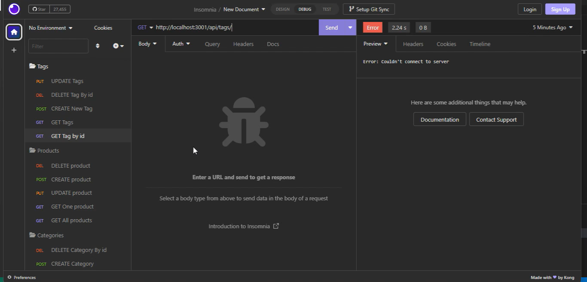

#  E-Commerce

## Description
This app uses sequelize orm to create the database 
E-commerce  app will ask you questions,
which will help you to store your information into database.

## Installation 
This app require  
[ Express package](https://www.npmjs.com/package/mysql2) 
[ MySQL2 package](https://www.npmjs.com/package/mysql2) 
[Sequelize package](https://www.npmjs.com/package/sequelize) 
[dotenv package](https://www.npmjs.com/package/dotenv) 

## Usage 
Clone the  repo in your pc. 
[Video-Guide](https://watch.screencastify.com/v/rmX1DY920IKDKXxXTXmo) 

## License
MIT
## Questions
halimshini@hotmail.com

